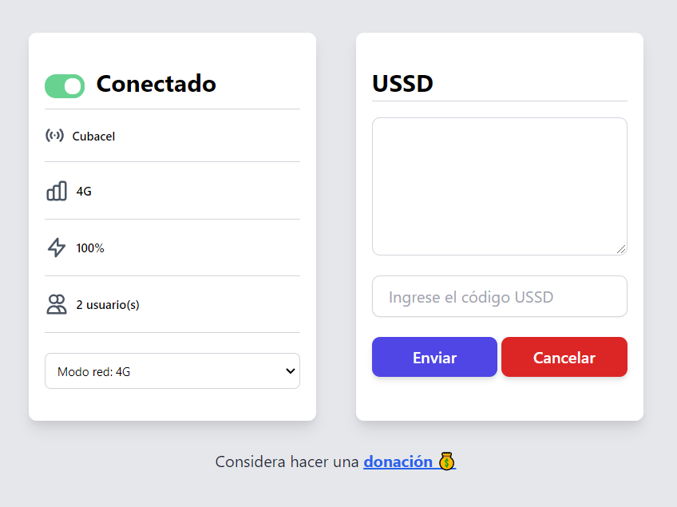

[](https://github.com/raulcr98/link-zone-desktop/actions/workflows/electron-compiler.yml)

## Link Zone Manager

App de escritorio para manejar fácilmente tu Link Zone de la infame Etecsa.




## Usage

### Install Dependencies 

```
$ cd my-app

# using yarn or npm
$ yarn (or `npm install`)

# using pnpm
$ pnpm install --shamefully-hoist
```

### Use it

```
# development mode
$ yarn dev (or `npm run dev` or `pnpm run dev`)

# production build
$ yarn build (or `npm run build` or `pnpm run build`)
```

## Donations

### ENZONA CUP


### QVAPAY

https://qvapay.com/payme/linkzone
